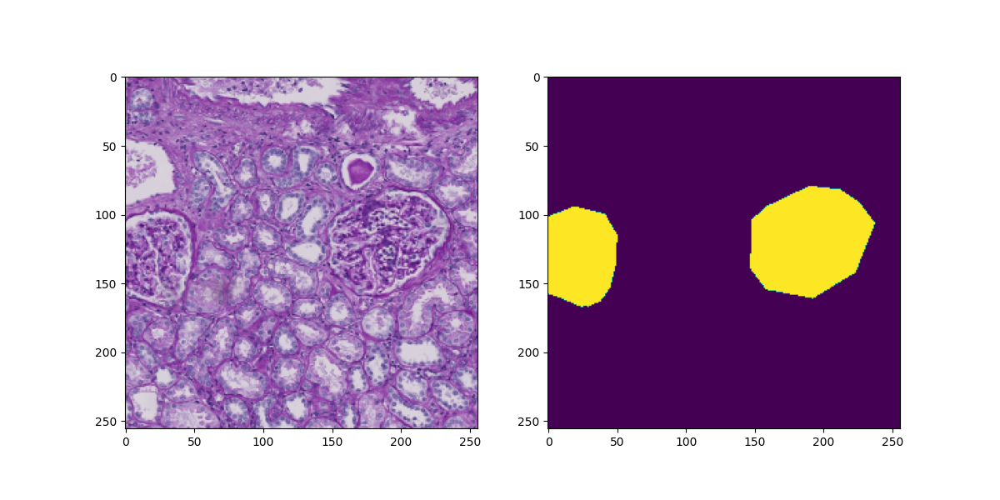
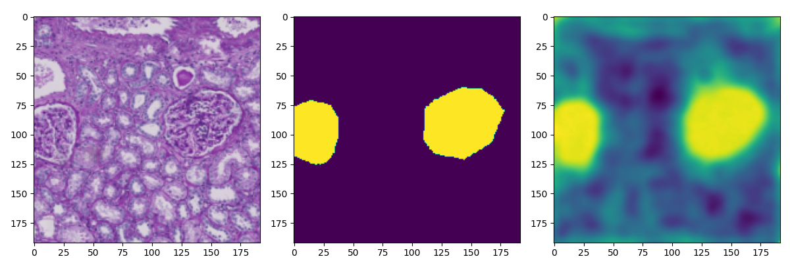
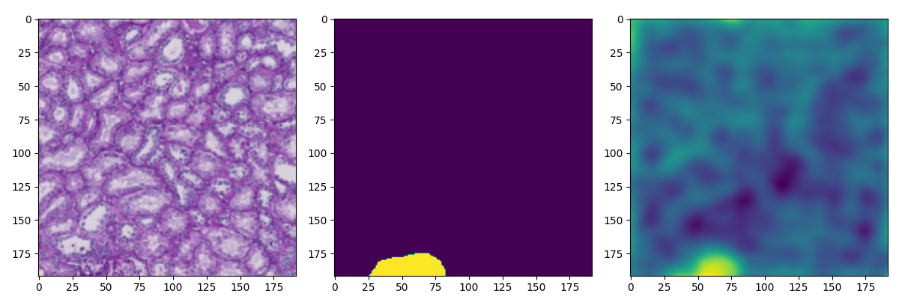
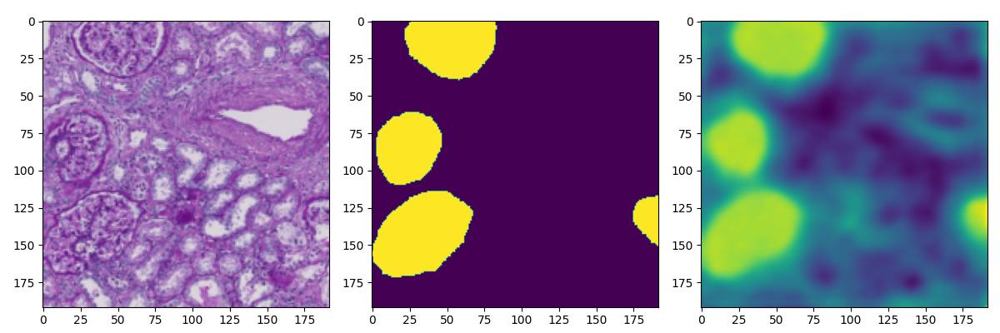

# Glomerular Segmentation of Kidney Images using U-Net

## Introduction

The glomerulus is a biological structure in the kidney that functions to filter waste materials in the blood.
Abnormalities in the glomerulus lead to a decrease in the filtration function of the blood, resulting in diseases such as chronic kidney disease (CKD).
One of the diagnostic methods for glomerular diseases is diagnostic imaging, which involves taking a sample from the kidney, staining it, and taking microscopic images. 
Here we construct a model to recognize glomeruli functional tissue units (FTU) from microscopic images of kidneys using the segmentation model.

## Dataset

Dataset consists of images of kidney and corresponding annotation information representing the glomerular segmentation.
Original dataset of HuBMAP consists of PAS-stained kidney microscopy images from 20 tissue samples, 11 fresh frozen and 9 formalin fixed paraffin embedded (FFPE), and 8 training and 5 test tissue images were provided for Kaggle competition.
Annotation information links each pixel in an input image to a class label “1” for Glomerulus and “0” for everything else.
For training and test, the original images were cropped to 7,664 training and 1,916 test image patches and corresponding masks with size (256, 256) image patches.

## Evaluation

As a metrics of evaluation, we compared predicted segmentation masks for test set with the ground truth masks using Dice coefficient (𝟐∗|𝑿∩𝒀|)/(|𝑿|+|𝒀|), when X as predicted mask pixels and Y as ground truth mask pixels.
Dice coefficient equals 1 when X and Y are the same.
We evaluate the mean value of Dice coefficient for each predicted masks.

## Models

U-Net is a convolutional neural networks (CNN) for the semantic segmentation
The architecture contains two paths, encoder and decoder, and keeps the location information in the down-sampling and combine them with the image features during the up-sampling.

## Results

## References 

- [HuBMAP - Hacking the Kidney](https://www.kaggle.com/c/hubmap-kidney-segmentation)
- Usuyama, [PyTorch-UNet](https://github.com/usuyama/pytorch-unet)
- Ronneberger et al., [U-Net: Convolutional Networks for Biomedical Image Segmentation](https://lmb.informatik.uni-freiburg.de/people/ronneber/u-net/)
- Long et al., [Fully Convolutional Networks for Semantic Segmentation](https://people.eecs.berkeley.edu/~jonlong/long_shelhamer_fcn.pdf)
