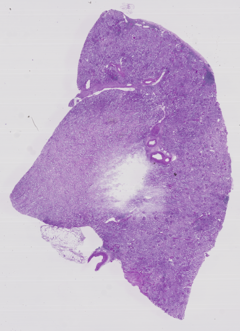
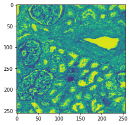
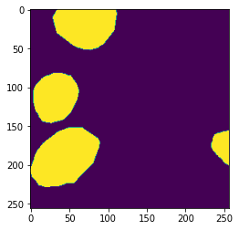

# Glomerular Segmentation of Kidney Tissue Images using U-Net

## Introduction

The *glomerulus* is one of biological substructures in a kidney, which physiologically functions to filter waste materials from the blood. Abnormalities in the glomerulus lead to a decrease in blood filtration performance, subsequently resulting in the development of kidney diseases such as *chronic kidney disease*, CKD.

*Medical imaging* is an important method in diagnosing kidney diseases caused by glomerular abnormalities. For the kidney tissue image, a biopsy is taken from a patient's kidney by needle, then stained and imaged under a microscope. An example is shown in Figure 1.



**Figure 1. An example of the overall view of the kidney tissue image used as the source for the analysis. The image is high resolution for diagnostic purposes and in the case of this image is provided in TIFF format with 18,484$\times$13,013 pixels.**

The pathologist observes the conditions of the glomeruli in the biopsy kidney tissue image obtained to diagnose kidney disease. The motivation is to perform the entire diagnostic process by computational methods, but as a preliminary step, we segment the kidney tissue images and construct a model to recognize the glomeruli.

## Dataset

The dataset is based on kidney tissue images provided by *The Human BioMolecular Atlas Program*, HuBMAP, and the corresponding annotations indicating glomerular segmentation[HuBMAP]. The kidney tissue images in the HuBMAP dataset consisted of 20 biopsies, 11 of which were fixed by *fresh frozen* and 9 of which by *formalin fixed paraffin embedded*, and then stained with *periodic acid-Schiff*, PAS. Of this biopsies, i.e., kidney tissue images, 8 were used for training, 5 for validation, and the remaining 7 were unused for testing.

The annotations indicating the segmentation of the glomeruli is provided as a binary image in which each pixel of the corresponding kidney tissue image is replaced by a classification label with 1 for the pixels in the glomerulus and 0 for the other pixels. This binary image is referred to as the *mask*.

For these kidney tissue images and masks, in order to keep the input to a model at a fixed size, we generated a 256 pixel square patch from the original image and a corresponding mask of the same size to serve as the dataset for training and validation. In total, 7,665 patches and masks were created from 8 samples for training and 1,916 from 5 samples for validation, respectively. An example of the correspondence between a patch and its mask is shown in Figure 2.




**Figure 2. An example of a created patch and corresponding mask.**

## Evaluation

Before performing the validation, we define the evaluation method. Assuming that the model generates a binary prediction mask similar to the mask for a given input image, for a patch in the validation set, we compare the predicted glomerular segmentation mask with the true mask corresponding to the patch of input given as annotation, and calculate *Dice coefficient*[Dice].
Let $X$ be the predicted mask and $Y$ be the true mask of the annotation, Dice coefficient is determined by
```math
\frac{2 \times |X \cap Y|}{|X|+|Y|}.
```
Dice coefficient takes values between 0 and 1, and is 1 if and only if $X$ and $Y$ are perfectly matched. Dice coefficient is calculated for all patches and masks in the validation set and averaged to obtain the accuracy to be evaluated.

## Models

We used *U-Net* as the model, which is a typical segmention model in *deep learning*, DL[Ronneberger]. U-Net is a model based on the *convolutional neural network*, CNN, and is capable of segmenting images according to their semantic connections.

The architecture of U-Net consists of two pathes: *encoder* and *decoder*. The encoder is the contracting path of capturing the semantic connections in the image while downsampling, and is implemented by the conventional convolution and *max pooling* layers. The decoder is a symmetric expanding path that combines semantic connections from image features to location information while upsampling, and is implemented by an end-to-end *full convolutional network*, FCN.

## Implementation in Python

For training and validation of U-Net, we used an implementation in a DL package in Python, `PyTorch`[Usuyama].

## Results

We obtained Dice coefficients of 0.880 for training and 0.794 for validation.
Examples of the patch as input to U-Net, the output predicted mask, and the true mask corresponding to the input patch are shown in Figure 3.


**Figure 3. Examples of the patch as input to U-Net, the output predicted mask, and the true mask corresponding to the input patch.**

# Furthermore

The application of U-Net has shown the potential for glomerular segmentation. To achieve higher accuracy, more images should be used for training, and optimization and fine-tuning of the model to kidney tissue images will be needed.

Glomerular segmentation from kidney tissue images is the first step in automating the diagnosis of kidney disease, which can then be modeled for classification of glomerular lesions and overall diagnosis.

## References

- [HuBMAP] HuBMAP Consortium, *The human body at cellular resolution: the NIH Human Biomolecular Atlas Program*, **Nature**, 574, 187–192, 2019.
- [Dice] L.R. Dice, *Measures of the Amount of Ecologic Association Between Species*, **Ecology**, 26, 3, 297–302, 1945.
- [Ronneberger] O. Ronneberger et al., *U-Net: Convolutional Networks for Biomedical Image Segmentation*, **arXiv**, 2015.
- [Usuyama] N. Usuyama, *Simple PyTorch Implementations of U-Net/FullyConvNet for Image Segmentation*, [GitHub](https://github.com/usuyama/pytorch-unet).
